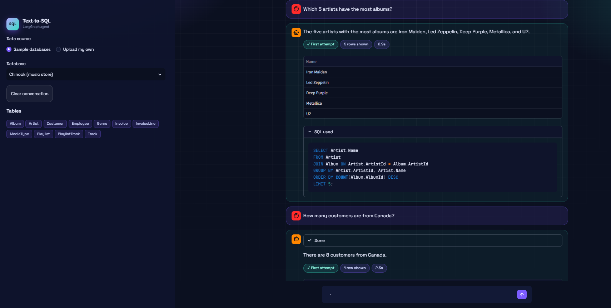
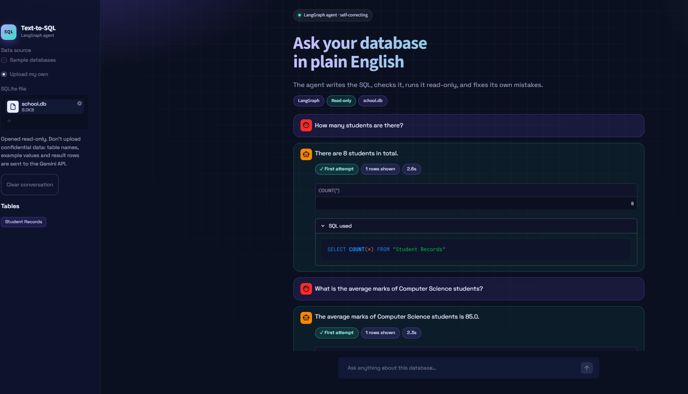

\# Text-to-SQL Agent

Ask a database questions in plain English. A LangGraph agent writes the SQL, checks it, runs it on a read-only connection, and corrects itself when the database returns an error.

\## Features

\- \*\*Self-correcting workflow:\*\* database errors are fed back to the model, with up to 3 retries

\- \*\*Safe by design:\*\* SELECT-only validation plus a read-only database connection

\- \*\*Follow-up questions:\*\* remembers the last 3 turns, so "What are their names?" works

\- \*\*Streamlit chat UI:\*\* live view of each agent step, the SQL used, and a results table

\- \*\*Bring your own database:\*\* upload any SQLite file (opened read-only)

\- \*\*Handles awkward names:\*\* tables and columns with spaces are quoted automatically

\- \*\*Evaluation sets:\*\* 18 tests across two databases, scored by comparing query results

\## How it works

question -> read schema (tables, columns, example values) -> generate SQL -> validate (SELECT only) -> run read-only -> on error, retry with the error message (max 3) -> plain-language answer

\## Setup

1\. Create and activate a virtual environment, then run: pip install -r requirements.txt

2\. Get a free API key from Google AI Studio and create a file named .env containing: GOOGLE\_API\_KEY=your\_key\_here

3\. Add the sample databases: download Chinook as chinook.db from https://github.com/lerocha/chinook-database and run python make\_shop\_db.py to create shop.db

\## Run

&#x20;   streamlit run streamlit\_app.py     (web UI)

&#x20;   python chat.py                     (terminal chat)

&#x20;   python eval.py                     (Chinook evaluation)

&#x20;   python eval\_shop.py                (shop evaluation; set DB\_FILE=shop.db first)

\## Privacy note

When you upload a database, table names, example column values and result rows are sent to the Gemini API to write the SQL and the answer. Do not upload confidential data.

\## Limitations

\- SQLite only. PostgreSQL and MySQL would need a different connection layer and a read-only database user.

\- Small evaluation sets. Example values are shown only for text columns with 10 or fewer distinct values.

\- The active database is one shared setting, so the app is built for one user at a time (fine locally, not for a public multi-user deployment).

\- The SQL keyword filter is blunt. The read-only connection is the real protection.

\## Credits

Inspired by LangChain's open-source text-to-SQL agent example (github.com/langchain-ai/text-to-sql-agent). This version was rebuilt as an explicit LangGraph workflow, with added safety layers, evaluation sets, follow-up memory, a Streamlit UI, and support for uploaded databases.

